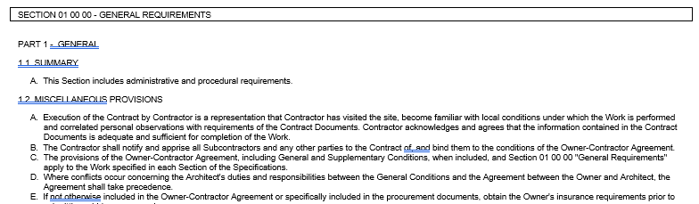
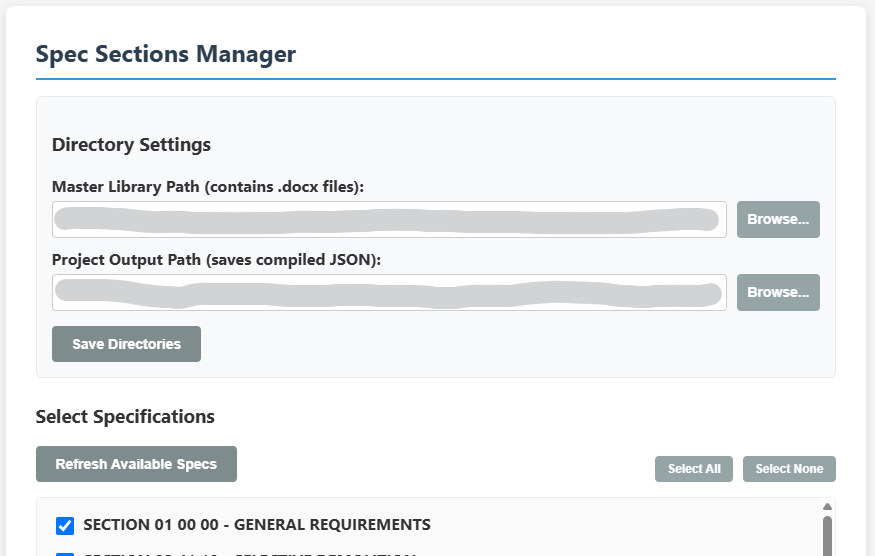
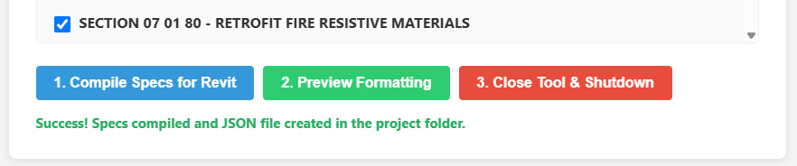
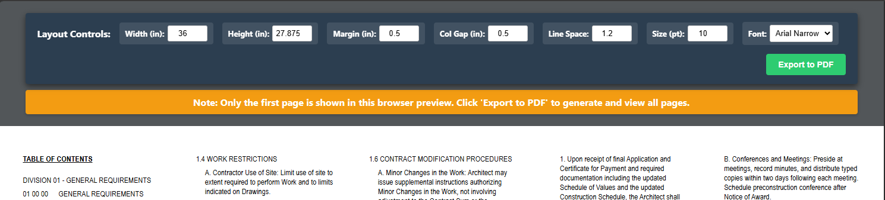
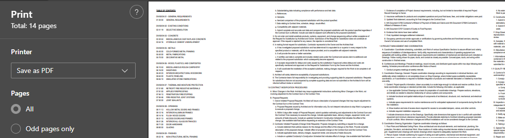

# Spec Master

This guide provides technical instructions for configuring source documents, adjusting code-level text formatting, navigating the HTML Spec Section Manager web dashboard, and executing the end-user workflow.

> **PREREQUISITE:** You must have Python installed for this tool to work. Python is available for install from Software Center.

## Table of Contents
  * [Document Setup and Formatting](#document-setup-and-formatting)
  * [End-User Workflow](#end-user-workflow)
  * [Adjusting Text Formatting in Code](#adjusting-text-formatting-in-code)
  * [PDF Export](#pdf-export)

---

### Document Setup and Formatting

Before using the tool, ensure your specifications files are configured correctly:

* **Individual Spec Sections:** Each 3-part specification section must be saved as an individual Word document.
* **CSI Formatting:** All text within these Word documents must adhere strictly to CSI Masterspec formatting conventions. The tool assumes your text is formatted per Masterspec list hierarchy.
* **Critical Notes (Red Text):** Any critical notes still requiring user review or modification at the time of export should be formatted in red text within the source Word document. 
* **Red Text Flagging:** The HTML tool preserves this red text in its PDF export.

---

### End-User Workflow

1. **Copying spec files** Copy the folder of Individual Specs from the server to your project folder. If making or copying your own spec files, see previous section for requirements.

2. **Launching the Dashboard:** To start the tool, simply double-click the designated Windows shortcut (which points to the `manager.pyw` file). The script will silently spin up a local Python server in the background and automatically open the dashboard in your default web browser (typically to the `index.html` file stored in the same folder as `manager.pyw`).

3. **Setting a project specs folder:** Once the web page loads, you will see the interface shown below. You will need to set two folder paths, one containing all the individual spec section files

4. **Selecting Spec Sections:** Two options for selecting specs:

* Check or uncheck the boxes to turn specific sections "on" or "off" for your current project. As you toggle these sections, the Table of Contents will automatically generate and update to match your selections. Hold Shift to check/uncheck multiple sections.
* Simply remove the corresponding Word doc files from your project specs folder copied from Step 1.

5. **Compiling the Data:** When you are satisfied with your selected sections, initiate the compilation by clicking "1. Compile Specs for Revit". The backend engine will grab the text from your selected files, build the Table of Contents, and stitch everything together into a single, continuous package (like a JSON or text file) that is formatted for a Revit sheet.

6. **Previewing the Layout:** A green 'success' message should appear at the bottom of the window. Click "2. Preview Formatting" to open a new tab with a simulation of what the sheet will look like. `Note that this is not representative of the exact output. Due to the inherent differences between CSS/HTML and PDF, this preview will only ever be an approximation -- See PDF Export section at the bottom`

7. **Adjusting Layout:** In the Preview tab, you'll be able to adjust layout controls including:

 * PDF sheet width and height
 * Sheet Margins
 * Column gap (gap between columns)
 * Line spacing
 * Font size
 * Font (choose between Arial Narrow and Arial)

8. **Export PDF:** Click the green Export to PDF button to bring up your browser's native print dialog for exporting to PDF. Highly recommend selecting "Save as PDF" from the printer list to preserve sheet size on export. Your browser's print preview should show the final layout.

9. **Closing the Tool:** When you are finished managing the specs, close the preview tab. Go back to the manager tab and click "3. Close Tool & Shutdown". This will shut down the Python server listening for commands from the html website.

10. **Placing/Updating in Revit:** Finally, switch over to your Revit project and click the "Update Specs" button on your pyRevit ribbon. The script will locate any existing spec text notes tied to that package, delete them entirely, and automatically regenerate fresh, fully formatted text columns on your sheet using the newly compiled data.

---

### Adjusting Text Formatting in Code

Visual formatting preferences are controlled via the tool's underlying code. To adjust text formatting, you must edit the code directly.

1. **Locate the CSS File:** Open the CSS stylesheet associated with the web dashboard's frontend interface.
2. **Target the Classes:** Locate the specific CSS classes mapped to the CSI hierarchy (e.g., `section-header`, `part-title`, `list-level-1`).
3. **Modify Properties:** Edit standard CSS properties (e.g., `font-weight`, `margin-left`, `text-decoration`) to reflect your desired visual output. 
4. **Save and Refresh:** Save the file and hard-refresh the browser dashboard to review the updated formatting.

![Placeholder: Screenshot of CSS Code Snippet Highlighting Formatting Classes]

---

### PDF Export

> **Disclaimer:** The visual preview rendered in the HTML/CSS web dashboard may not perfectly match the final output of the exported PDF.

HTML web browsers and PDF generators utilize entirely different rendering engines. These differences affect how the engines calculate font spacing, margins, and word-wrapping. Always review the final PDF export to verify precise line breaks and layout alignments.

![Placeholder: Screenshot of side-by-side comparison showing HTML preview vs. PDF export]

---

